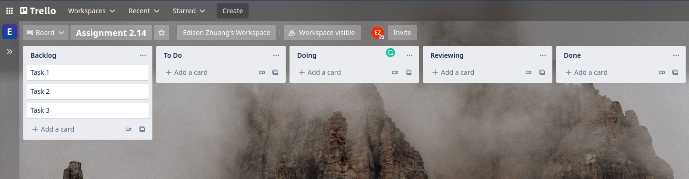

# Agile SCRUM: Assignment

## Brief

There are two parts to this assignment. 

In part 1, you are to set up a task tracker platform with you group. As your project week is drawing near, the task tracker platform will allow you to setup product backlog and sprint backlog.

In part 2, you are to venture into research online, engage in group discussion and then produce a personal conclusion for submission.

## Part 1 - Setup Task Tracker

You are recommended to use [Trello](https://trello.com/) for quick and simple setup. Everyone should create an account on Trello, but only one of you are required to setup the board (don't choose from template, just create a new board) and share the board with the rest of the group members. 

Once you are done, setup 5 columns:
1. Backlog (to add)
1. To Do (default)
1. Doing (default)
1. Reviewing (to add)
1. Done (default)

The result of it should look like this:



```
// Part 1 link: https://trello.com/b/mdyieB3k/sdi-c1-group2
```

## Part 2 - Research and Discuss

Reflect on the [Agile Manifesto](https://agilemanifesto.org/), phrase them in no more than five sentences in your own words.

```
// 
- To promote self-management and communications among the team instead of having traditional top-down work flow processes.

- To create functional software and not over-do your task.

- Work closely together with customers to understand their needs and cater to their desired product.

- Be adaptive to change what does not work or what could work better. 
```

Agile Methodology does not just apply to software development but any project management. Recollect the 12 principles of Agile and share which three principles are commonly violated in your experience and what can be done differently?

```
// 
1) Build projects around motivated individuals. Give them the environment and support they need, and trust them to get the job done.
- Micro-managing and not giving the freedom and trust to complete the job. It is neccessary to let members explore and express themselves so as not to limit their creativity.

2) Maintain a constant pace
- Doing too much will result in burnt-out, while doing too little will result in snowballing of backlogs. It is neccessary to keep at your own manageable pace for the long run.

3) Continuous attention to technical excellence and good design enhances agility.
-  Complex codes will be hard for others to understand and follow up. We need to write codes that are DRY and easy for others to comprehend. 
```

What are the three roles that make up a SCRUM Team? Explain the function(s) of the three roles.

```
// 
1) Product Owner
- Manages the Product Backlog and optimizes value of product.
2) Scrum Master
- Manages the Scrum process and removes impediments.
3) Development Team
- Self-managing. Collaboratively create task to meet their forecast as reflected in the Sprint Backlog, re-plan their work on a daily basis within the time-boxed Sprint and deliver a potentially releasable increment of software at the end of each Sprint.
```

What are the SCRUM Values? 

```
// 
1) Commitment
2) Focus
3) Openness
4) Respect
5) Courage
```

How many types of meetings are there in SCRUM? What is the purpose of each of them?
```
// 
1) Sprint Planning Meeting
- At the beginning of every Sprint, develop realistic Sprint backlog and define the highest priority tasks which need to be done during the length of each Sprint.

2) Daily Scrum Meeting
- short 15 minutes meetings which occur on daily basis. only task-statuses and hindrances are discussed.

3) Sprint Review Meeting
- At the end of each Sprint, demonstrate the functionality of the product and what has been achieved. product performance is also measured against the original Sprint goals to oversee any major changes.

4) Sprint Retrospective Meeting
- reviewing what went right, wrong and what improvements are needed to be made. A thorough analysis of what should be done in future.

5) Backlog Refinement Meeting
- the product backlog items are categorized and prioritized after a technical discussion with the team to make sure that the team understands what exactly are the deliverables and what are the requirements. It reduces the need for a long Sprint planning meeting and gives the team a chance to reflect on the backlog items before fully committing to the Sprint goals.
```

## Submission Guidelines

- Cite any relevant sources consulted during your research
- Solve the problems using your own code
- Do not copy and paste solutions from the source material
- Submit your assignment to black board.
